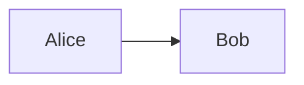

## Introduction
+ Crypto symétrique
## COUCOU LES GENS

---

## Modelization in R
We had to model our set of symbols, here lowercase letters from the latin standard alphabet. We stored our letters inside a vector, which is one of the native R types which is quite close to C structures, and so, fast to iterate through.
```r
alphabet <- c(letters)
print(alphabet)
```
When we print our variable 'alphabet', we do notice we only have the 26 latin common characters, which depicts one of the first limitations of our starting algorithm (more on that later).

---


## Encoding
Once we have our set of symbols, we can 
```r
encrypt <- function(text, key) {
  stext <- strsplit(text, "")[[1]]
  ret = c()
  for(letter in stext){
    # position de la lettre dans l'alphabet
    index <- match(c(letter),alphabet)
    # on calcule le nouvel index
    new_index <- index + key
    if(new_index<1) {
      new_index <- new_index + 26
    }
    else if(new_index>26){
      new_index <- new_index - 26
    }
    ret <- append(ret,alphabet[new_index])
  }
  paste(ret, collapse = '')
}

print(encrypt("zweezweeeezweeee",-6))
```
## Decoding

```r
decrypt <- function(text, key) {
  stext <- strsplit(text, "")[[1]]
  ret = c()
  for(letter in stext){
    # position de la lettre dans l'alphabet
    index <- match(c(letter),alphabet)
    # on calcule le nouvel index
    new_index <- index - key
    if(new_index<1) {
      new_index <- new_index + 26
    }
    else if(new_index>26){
      new_index <- new_index - 26
    }
    ret <- append(ret,alphabet[new_index])
  }
  paste(ret, collapse = '')
}

decrypt_2 <- function(text, key){
  return(encrypt(text,-key))
}

print(decrypt_2("sheeeeeeeeeeeeeeesh",3))
```

## Bruteforce decoding

```r
unk_decrypt <- function(text) {
  res <- c()
  for(sup_key in 1:26) {
    res <- append(res,decrypt(text,sup_key))
  }
  return(res)
}

print(unk_decrypt("khoor"))
```

## Probability decoding

```r
unk_decrypt_2 <- function(text) {
  res <- c()
  stext <- strsplit(text, "")[[1]]
  compteur <- as.data.frame(table(stext))
  most_present <- subset(compteur,compteur$Freq==max(compteur$Freq),select=stext)$stext[1]
  tries <- c("e","a","s","i","n")
  for(char in tries) {
    new_dist <- match(c(most_present),alphabet) - match(c(char),alphabet)
    res <- append(res,decrypt_2(text,new_dist))
  }
  return(res)
}

print(unk_decrypt_2(encrypt("sheeeeeeeeeeeeeeeesh",5)))
```
# Limitations
Tied to our algorithm:
+ Only standard characters are implemented (no space, no special characters, no numbers)
+ We lean on suboptimized structures and language for this usecase

Tied to the system:
+ We do more or less a number, it's easy to bruteforce!
+ With letter frequency in mind, it's easy to guess what key it is even without running the algorithm.
# Going further
## Possible upgrades to Caesar cipher
### Encoding-wise
Ignoring or havig another table to compare 

### Decoding-wise
We can do a querry against a database with common words from the supposed language, and seek to identifiy some of them in our decoded assertion ; and favor the one from which we can identify numerous words.
A simple improvment could be done by boosting our 'tries' variable with letters probabilities granted from languages' probability of apparitions.

## Asymmetric cryptography
### Base concept
Rely on one-ways functions (function that can easily be calculated but hardly reversed) that maintains a hidden flaw (which will be the decoding key).


Pros :
+ More secure
+ We can identify the sender

Cons :
+ Calculations takes longer time
+ Keys must be much longer
+ If initial key is hacked, all data that has benn encrypted with it is compromised