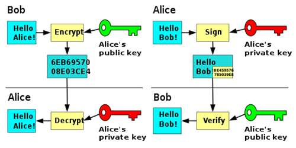

# What is Caesar cipher?


[//]: # (Caesar cipher is one of many methods classified under the symmetric cryptography ; which means )

---

# Modelization in R

[//]: # (We had to model our set of symbols, here lowercase letters from the latin standard alphabet. We stored our letters inside a vector, which is one of the native R types close enough to C structures, and so, quite fast to iterate through.)
```r
> alphabet <- c(letters)
> print(alphabet)
```
[//]: # (When we print our variable 'alphabet', we do notice we only have the 26 latin common characters, which depicts one of the first limitations of our starting algorithm, more on that later.)

```r
[1] "a" "b" "c" "d" "e" "f" "g" "h" "i" "j" "k" "l" "m" "n" "o" "p" "q" "r" "s" "t" "u" "v" "w" "x" "y" "z"
```

---


# Encoding (1/2)

[//]: # (Once we have our set of symbols, and the key provided by user, we can encrypt our plain text into encrypted one)

```r
encrypt <- function(text, key) {
  stext <- strsplit(text, "")[[1]]
  ret = c()
  for(letter in stext){
    index <- match(c(letter),alphabet)
    new_index <- index + key
    if(new_index<1) {
      new_index <- new_index + 26
    }
    else if(new_index>26){
      new_index <- new_index - 26
    }
    ret <- append(ret,alphabet[new_index])
  }
  paste(ret, collapse = '')
}
```
---
# Encoding (2/2)

```r
> print(encrypt("helloworld",4))
[1] "lippsasvph"
> print(encrypt("zweezweeeezweeee",-6))
[1] "tqyytqyyyytqyyyy"
> print(encrypt("meow",1))
[1] "nfpx"
```
---
# Decoding (1/2)

```r
decrypt <- function(text, key) {
  stext <- strsplit(text, "")[[1]]
  ret = c()
  for(letter in stext){
    index <- match(c(letter),alphabet)
    new_index <- index - key
    if(new_index<1) {
      new_index <- new_index + 26
    }
    else if(new_index>26){
      new_index <- new_index - 26
    }
    ret <- append(ret,alphabet[new_index])
  }
  paste(ret, collapse = '')
}
```
Really close to our other function...

---
# Decoding (1/2)
```r
decrypt_2 <- function(text, key){
  return(encrypt(text,-key))
}
```
```r
> print(decrypt("lippsasvph",4))
[1] "helloworld"
> print(decrypt_2("lippsasvph",4))
[1] "helloworld"
> print(decrypt(encrypt("sheeeeeesh",6),6))
[1] "sheeeeeesh"
```
---
# Bruteforce decoding

```r
unk_decrypt <- function(text) {
  res <- c()
  for(sup_key in 1:26) {
    res <- append(res,decrypt(text,sup_key))
  }
  return(res)
}
```
```r
> print(unk_decrypt("khoor"))
 [1] "jgnnq" "ifmmp" "hello" "gdkkn" "fcjjm" "ebiil" "dahhk" "czggj" "byffi"
 "axeeh" "zwddg" "yvccf" "xubbe" "wtaad" "vszzc" "uryyb" "tqxxa" "spwwz"
 "rovvy" "qnuux" "pmttw" "olssv" "nkrru" "mjqqt" "lipps" "khoor"
```
---
# Probability decoding

```r
unk_decrypt_2 <- function(text) {
  res <- c()
  stext <- strsplit(text, "")[[1]]
  compteur <- as.data.frame(table(stext))
  most_present <- subset(compteur,compteur$Freq==max(compteur$Freq),select=stext)$stext[1]
  tries <- c("e","a","s","i","n")
  for(char in tries) {
    new_dist <- match(c(most_present),alphabet) - match(c(char),alphabet)
    res <- append(res,decrypt_2(text,new_dist))
  }
  return(res)
}
```
```r
> print(unk_decrypt_2("khoor"))
[1] "axeeh" "wtaad" "olssv" "ebiil" "jgnnq"
> print(unk_decrypt_2("apmmmmmmap"))
[1] "sheeeeeesh" "odaaaaaaod" "gvssssssgv" "wliiiiiiwl" "bqnnnnnnbq"
```
---
# Limitations and upgrades to Caesar cipher (1/2)
Tied to our algorithm:
+ Only standard characters are implemented
+ We lean on suboptimized structures and language for this usecase

Tied to the system:
+ We do more or less a number, it's easy to bruteforce!
+ With letter frequency in mind, it's easy to guess.
---
```r
encrypt_upgraded <- function(text, key) {
  stext <- strsplit(tolower(text), "")[[1]]
  ret = c()
  for(letter in stext){
    if(letter %in% alphabet){
      index <- match(c(letter),alphabet)
      new_index <- index + key
      if(new_index<1) { new_index <- new_index + 26 }
      else if(new_index>26){ new_index <- new_index - 26 }
      ret <- append(ret,alphabet[new_index])
    }
    else { ret <- append(ret,letter) }
  }
  paste(ret, collapse = '')
}
```
```r
> print(encrypt("Lorem ipsum dolor sit amet, consectetur adipiscing elit, sed do
 eiusmod tempor incididunt ut labore et dolore magna aliqua.",4))
[1] "psviq mtwyq hspsv wmx eqix, gsrwigxixyv ehmtmwgmrk ipmx, wih hs imywqsh xiqtsv
 mrgmhmhyrx yx pefsvi ix hspsvi qekre epmuye."
```
--- 
# Limitations and upgrades to Caesar cipher (2/2)

+ We can do a querry against a database with common words from the supposed language, and seek to identifiy some of them in our decoded assertion ; and favor the one from which we can identify numerous words.
+ A simple improvment could be done by boosting our 'tries' variable with letters probabilities granted from languages' probability of apparitions.
---
```r
languages <- c("french"="etaoi", "english"="esait")

unk_decrypt_2_upgraded <- function(text,esm_language) {
  res <- c()
  stext <- strsplit(text, "")[[1]]
  stext <- stext[stext %in% alphabet]
  compteur <- as.data.frame(table(stext))
  most_present <- subset(compteur,compteur$Freq==max(compteur$Freq),select=stext)$stext[1]
  for(char in strsplit(languages[esm_language], "")[[1]]) {
    new_dist <- match(c(most_present),alphabet) - match(c(char),alphabet)
    res <- append(res,decrypt_2_upgraded(text,new_dist))
  }
  return(res)
}
```
```r
> print(encrypt("But I must explain to you how all this mistaken idea [...]",4))
[1] "fyx m qywx ibtpemr xs csy lsa epp xlmw qmwxeoir mhie [...]"

> print(unk_decrypt_2_upgraded(text,"english"))
[1] "but i must explain to you how all this mistaken idea [...]"
[2] "pih w aigh sldzowb hc mci vck ozz hvwg awghoysb wrso [...]"
[3] "xqp e iqop atlhwej pk ukq dks whh pdeo ieopwgaj ezaw [...]"
[4] "fyx m qywx ibtpemr xs csy lsa epp xlmw qmwxeoir mhie [...]"
[5] "qji x bjhi tmeapxc id ndj wdl paa iwxh bxhipztc xstp [...]"
```
---
# Asymmetric cryptography
Rely on one-ways functions (function that can easily be calculated but hardly reversed) that maintains a hidden flaw (which will be the decoding key).



---

## Pros :
+ More secure, impossible to bruteforce
+ We can identify the sender with double encryption

## Cons :
+ Calculations takes longer time, for encoding as for decoding
+ Keys must be much longer, and so uses more space
+ If initial key is hacked, all data that has been encrypted with it is compromised